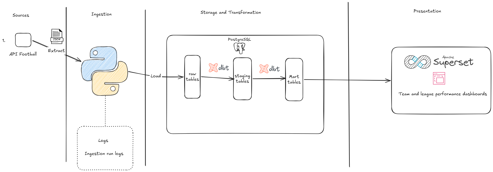
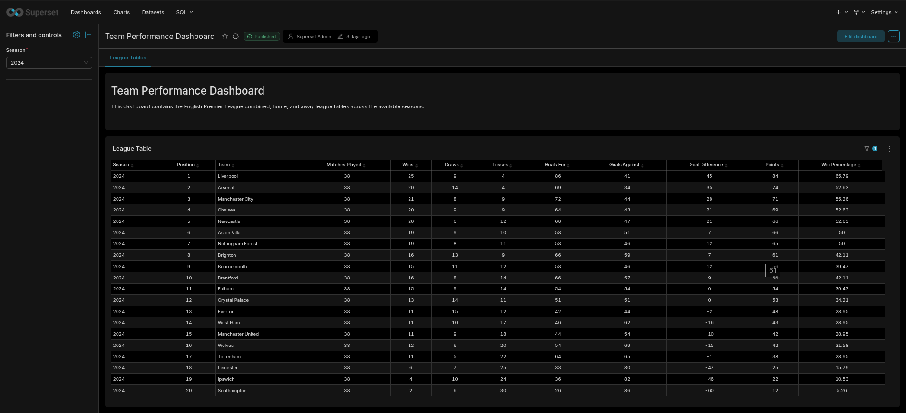
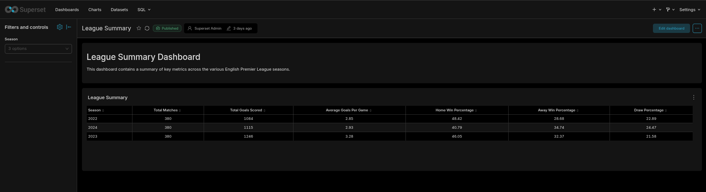

# premier-league-data-pipeline

## Architrecture



## Tech stack

Python, SQL, PostrgeSQL, dbt, Apache Superset

## Features

* Extracts football data from the API-Football API.
* Incremental loading to avoid inserting duplicate teams and matches. (Idempotency)
* PostgreSQL acts as the data warehouse.
* dbt staging models for duplicate handling and standardisation.
* dbt data quality tests.
* Analytical marts for league and team performance.
* Interactive Apache Superset dashboards.
* Comprehensive logging throughout the ingestion pipeline.

## Future improvements

* Add additional data sources as api-football has a limit of 3 seasons on free plan
* Deploy the data warehouse and pipeline to AWS.
* Containerise the project

## How to run

### 1. Clone this repository

```bash
git clone https://github.com/syntax-ray/premier-league-data-pipeline.git (HTTPS)

or

git clone git@github.com:syntax-ray/premier-league-data-pipeline.git (SSH)

cd ./premier-league-data-pipeline
```

### 2. Create a virtual environment

```bash
python -m venv .venv
```

Activate it:

Windows

```bash
.venv\Scripts\activate
```

Linux / macOS

```bash
source .venv/bin/activate
```

### 3. Install dependencies

```bash
pip install -r requirements.txt
```

### 4. Create a `.env` file

The structure of the `.env` file is outlined in the env-struct file.

### 5. Start up PostgreSQL

Once the .env file has been updated with PostgreSQL credentials start docker.

```bash
docker compose up 
```
### 6. Run the ingestion scripts

```bash
python ingestion/fetch_leagues.py
python ingestion/fetch_teams.py
python ingestion/fetch_matches.py
```

### 7. Build the dbt models

```bash
cd ./pl_dbt
dbt run
dbt test
```

### 8. Launch Apache Superset

To build dashboards from the warehouse:
  - Clone superset this superset fork with postgresql configurations: https://github.com/syntax-ray/superset
  - cd into the directory
  - Switch git branch to pl_superset
  - Launch Superset with the command: sudo docker compose -f docker-compose-image-tag.yml up -d
  - Connect Superset to the warehouse

## Dashboard Screenshots

### Team Performance Dashboard



The Team Performance Dashboard provides an interactive English Premier League league table across all available seasons.

**Features**
- Season filter for comparing different Premier League seasons.
- Complete league standings.
- Team position and points.
- Matches played.
- Wins, draws and losses.
- Goals scored and goals conceded.
- Goal difference.
- Win percentage.

---

### League Summary Dashboard



The League Summary Dashboard provides season-level analytics across the available Premier League seasons.

**Features**
- Season filter for comparing league statistics across seasons.
- Total matches played.
- Total goals scored.
- Average goals per match.
- Home win percentage.
- Away win percentage.
- Draw percentage.